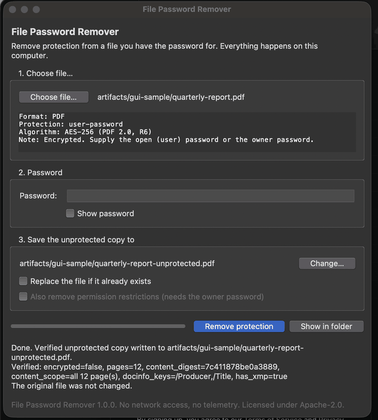
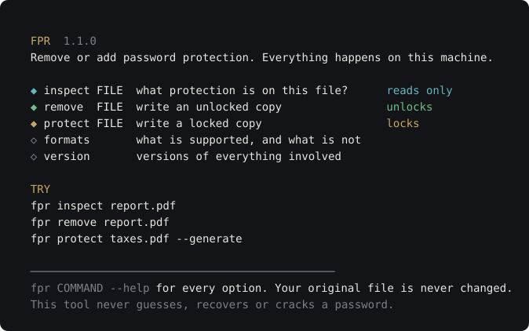
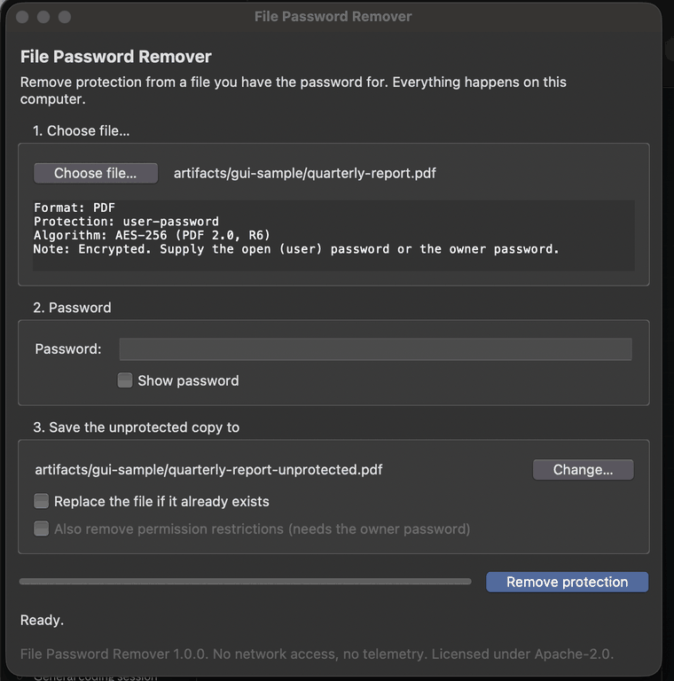
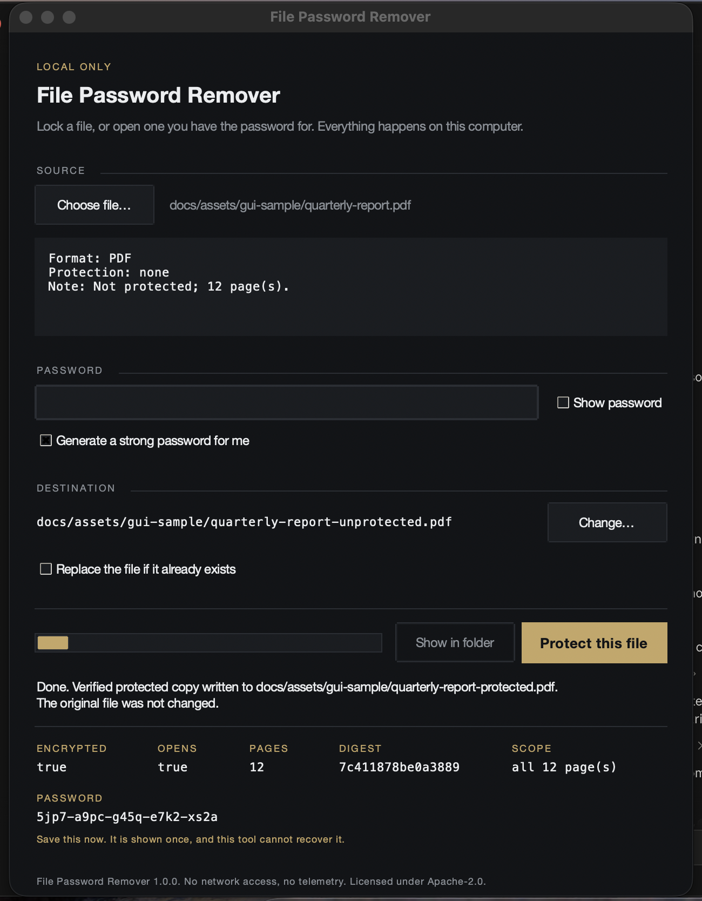
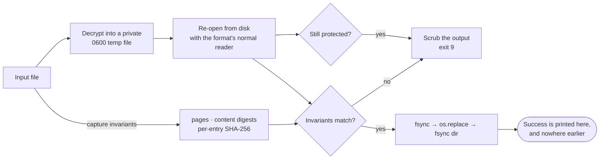

<div align="center">



# File Password Remover

### Unlock the files you own — on your machine, with proof the result is intact.

*No uploads. No account. No telemetry. No network code at all.*

[](https://github.com/Jayanth-reflex/file-password-remover/actions/workflows/ci.yml)
[](https://github.com/Jayanth-reflex/file-password-remover/actions/workflows/security.yml)
[](https://github.com/Jayanth-reflex/file-password-remover/releases/latest)
[](https://github.com/Jayanth-reflex/file-password-remover/pkgs/container/file-password-remover)

[](docs/reports/verification-report.md)
[](#platform-support)
[](pyproject.toml)
[](docs/adr/0002-local-only-no-backend.md)
[](LICENSE)

<br>

```bash
pipx install git+https://github.com/Jayanth-reflex/file-password-remover
fpr remove quarterly-report.pdf
```

<sub><b><a href="#install">Install</a></b> · <b><a href="#the-60-second-tour">Tour</a></b> · <b><a href="#how-you-know-it-actually-worked">How it proves itself</a></b> · <b><a href="#supported-formats">Formats</a></b> · <b><a href="#using-this-with-ai-agents">AI agents</a></b> · <b><a href="#documentation">Docs</a></b></sub>

</div>

---

## The problem

You have a PDF you know the password for. You are tired of typing it.

The usual answer is to upload the file — **and the password** — to a website you
have never heard of, and hope.

This does the same job on your machine. There is no server to trust, because
there is no server. The package contains no network code at all, and a test
parses every module and fails the build if anyone adds any.

<table>
<tr><th align="left"></th><th align="left">Online “unlock PDF” sites</th><th align="left"><code>fpr</code></th></tr>
<tr><td>Your file goes</td><td>To their server</td><td><b>Nowhere.</b> It never leaves the disk</td></tr>
<tr><td>Your password goes</td><td>To their server</td><td>Into a wipeable buffer, zeroed on exit</td></tr>
<tr><td>Afterwards</td><td>Their retention policy</td><td>There is no “afterwards”</td></tr>
<tr><td>Proof the output is intact</td><td>None</td><td>Page counts + content digests, compared</td></tr>
<tr><td>Works offline / air-gapped</td><td>No</td><td>Yes</td></tr>
<tr><td>Strips protection you can’t authenticate</td><td>Usually yes</td><td><b>No — and that is the point</b></td></tr>
</table>

That last row matters most. Most “unlockers” open a PDF with an **empty**
password and re-save it without the permission flags. That is a bypass, not a
decryption. This refuses, unless you supply the owner password and ask for it
explicitly. ([ADR-0008](docs/adr/0008-owner-restriction-policy.md))

---

## The 60-second tour

**Start by typing `fpr`.** The menu is the whole tool on one screen, and every
command says what it does to your files before you run it — in words as well as
in colour, so it reads the same in a CI log and to a screen reader:

<p align="center">

</p>

**Look before you leap.** `inspect` needs no password and changes nothing:

```console
$ fpr inspect quarterly-report.pdf
quarterly-report.pdf
  format       PDF (pdf)
  protection   user-password
  algorithm    AES-256 (PDF 2.0, R6)
  removable    removable
  note         Encrypted. Supply the open (user) password or the owner password.
```

**Then unlock it.** The password is prompted for, never echoed, never stored:

```console
$ fpr remove quarterly-report.pdf
Password:
✓ VERIFIED  quarterly-report-unprotected.pdf
   removed     user-password
   algorithm   AES-256 (PDF 2.0, R6)
   size        2.3 MiB → 2.2 MiB · 0.41s

   ENCRYPTED  PAGES  DIGEST            SCOPE            DOCINFO           XMP
   false      12     7c411878be0a3889  all 12 page(s)   /Producer,/Title  true
   ──────────────────────────────────────────────

   saved to    /home/you/quarterly-report-unprotected.pdf
   original    /home/you/quarterly-report.pdf (unchanged)
```

That row of marks is the whole point — see [below](#how-you-know-it-actually-worked).

**Or go the other way.** `protect` locks a file that has no password yet, with
one you choose or one it generates:

```console
$ fpr protect notes.pdf --generate
✓ PROTECTED  notes-protected.pdf
   applied     user-password
   algorithm   AES-256 (PDF 2.0, R6)

   ENCRYPTED  OPENS  PAGES  DIGEST            SCOPE
   true       true   3      456cf7bce5ff12ef  all 3 page(s)
   ──────────────────────────────────────────────

   PASSWORD
   w5zd-mzy4-d6g8-s4g5-npvk
   Save this now. It is shown once, and this tool cannot recover it.
```

> [!WARNING]
> **A generated password is the only copy that will ever exist.** This tool
> refuses to crack, which is the point of it — and that means it is exactly the
> wrong tool for getting back into a file whose password you lost. Use
> `--password-out FILE` to write it straight to a `0600` file instead of the
> terminal, which keeps scrollback.

**A wrong password fails cleanly**, with no output file and a distinct exit code:

```console
$ fpr remove quarterly-report.pdf --password-stdin < wrong.txt
✗ Incorrect password for this file.
  Check the password (including keyboard layout and caps lock) and try again.
$ echo $?
3
```

No output file is created, nothing is partially written, and the tool does not
offer to try again — because it has no way to try that is not guessing.

<details>
<summary><b>Batch mode, scripting and JSON</b></summary>

<br>

A whole folder, one password, machine-readable output:

```bash
fpr --json remove ~/archive --recursive --pattern '*.docx' --output-dir ./clean
```

Scripted, without the password touching `argv`, the environment or the disk:

```bash
printf '%s' "$PASSWORD" | fpr remove book.pdf --password-stdin
```

> **There is no `--password VALUE` flag.** Command lines are readable by every
> process on the machine and land in your shell history. The option is parsed
> only so the tool can tell you that, instead of failing with "unrecognised
> argument". ([ADR-0007](docs/adr/0007-no-password-on-argv.md))

Thirteen stable exit codes, so scripts can branch on *why* something failed:
`3` wrong password, `5` corrupt input, `9` verification failed, and so on.
Full table in the [CLI reference](docs/ops/cli.md).

</details>

<details>
<summary><b>Prefer a window? <code>fpr-gui</code></b></summary>

<br>



<br>



<sub>Left to right in the marks: what was checked, and what came back. The password shown is one the tool generated for a file it really locked.</sub>

Drag a file in, type the password, watch the same verification line appear.
Every control is keyboard-reachable; there is a test that walks the focus ring
to prove it. The window has **not** been tested with a screen reader — if you
rely on one, the CLI is the supported path
([accessibility](docs/product/accessibility.md)).

</details>

---

## How you know it actually worked

Most tools print "Done" when the write call returns. That is not the same thing
as the file being good — qpdf will silently *recover* a truncated PDF and hand
back 3 pages where there were 12.

So `fpr` never reports success on a write. It reports success on a **read-back**:



If either check fails, the output is scrubbed and the run exits `9`. **A file
that cannot be proved good never reaches the name you asked for.**
([ADR-0004](docs/adr/0004-verify-before-publish.md))

> [!NOTE]
> **Honest limit.** This proves *output matches input*. It cannot prove the
> input was complete — a truncated source yields a faithful decryption of a
> truncated document. Recorded as
> [L-10](docs/reports/known-limitations.md), not glossed over.

---

## What it will and will not do

| | |
| :--- | :--- |
| ✅ **Will** | Decrypt a file when you supply a password its own verifier accepts, and write a new, unencrypted copy |
| ✅ **Will** | Add a password to a file that has none, with one you choose or one it generates, and prove the result opens |
| ❌ **Will not** | Recover, guess or brute-force a password. No dictionary, no retry loop, no "recovery mode" |
| ❌ **Will not** | Encrypt in place, encrypt a batch in one go, or write a locked file without showing you the password |
| ❌ **Will not** | Strip permission flags off a document you cannot authenticate against |
| ❌ **Will not** | Touch DRM, Information Rights Management, or certificate-based encryption |

These are enforced in code, not promised in a README. Every refusal has a test:
[abuse cases](docs/security/abuse-cases.md). Run `fpr formats` to see the
boundary from the tool itself.

| Class of protection | Example | What happens |
| :--- | :--- | :--- |
| 🔓 **Content encryption** | PDF open password · `.docx` "Encrypt with Password" · AES `.zip` | Removed once the password validates |
| 🔒 **Permission restrictions** | PDF with printing disabled and *no* open password | Removed **only** with the owner password **and** `--remove-restrictions` |
| 🚫 **Editing restrictions** | `<w:documentProtection>`, Excel sheet protection | Reported and refused — the content isn't encrypted, so removal would be a bypass |
| ⛔ **Rights management / DRM** | IRM, `Adobe.PubSec`, ebook DRM | Reported, never touched |

---

## Supported formats

| Format | Protection handled | Engine |
| :--- | :--- | :--- |
| **PDF** `.pdf` | Standard security handler R2–R6 — RC4-40, RC4-128, AES-128, AES-256 | pikepdf / qpdf |
| **Word · Excel · PowerPoint** `.docx` `.xlsx` `.pptx` *(+12 more)* | ECMA-376 agile (Office 2010+) and standard (2007) | msoffcrypto-tool |
| **ZIP** `.zip` | WinZip AES-128/192/256, legacy ZipCrypto | pyzipper |
| **7-Zip** `.7z` | AES-256 including encrypted headers | py7zr — [optional extra](docs/adr/0006-optional-lgpl-sevenzip-extra.md) |
| **Legacy Office** `.doc` `.xls` `.ppt` | RC4 / CryptoAPI — **experimental**, needs `--experimental` | msoffcrypto-tool |

Full matrix, including everything deliberately **un**supported and why:
[format-matrix.md](docs/product/format-matrix.md).

---

## Install

Pick your platform. Every row gives you a working `fpr` command in one step —
no Python required unless you want the desktop app or the API.

<table>
<tr>
  <th align="left" width="16%">Platform</th>
  <th align="left" width="46%">Recommended</th>
  <th align="left" width="38%">No install / no Python</th>
</tr>
<tr valign="top">
  <td>🍎 <b>macOS</b><br><sub>Apple silicon &amp; Intel</sub></td>
  <td>

```bash
pipx install git+https://github.com/Jayanth-reflex/file-password-remover
```

  </td>
  <td>

[**Download the `.tar.gz`**](https://github.com/Jayanth-reflex/file-password-remover/releases/latest/download/file-password-remover-macOS-ARM64.tar.gz)
→ unzip → run `./fpr`. Gatekeeper will warn — right-click → *Open* once.

  </td>
</tr>
<tr valign="top">
  <td>🐧 <b>Linux</b><br><sub>glibc 2.28+</sub></td>
  <td>

```bash
pipx install git+https://github.com/Jayanth-reflex/file-password-remover
```

  </td>
  <td>

[**Download the `.tar.gz`**](https://github.com/Jayanth-reflex/file-password-remover/releases/latest/download/file-password-remover-Linux-X64.tar.gz)
→ `tar xzf *.tar.gz` → run `./fpr`

  </td>
</tr>
<tr valign="top">
  <td>🪟 <b>Windows</b><br><sub>10 / 11, x64</sub></td>
  <td>

```powershell
pip install git+https://github.com/Jayanth-reflex/file-password-remover
```

  </td>
  <td>

[**Download the `.zip`**](https://github.com/Jayanth-reflex/file-password-remover/releases/latest/download/file-password-remover-Windows-X64.zip)
→ extract → run `fpr.exe`. SmartScreen will warn — click *More info → Run
anyway*.

  </td>
</tr>
<tr valign="top">
  <td>🐳 <b>Docker</b><br><sub>any OS</sub></td>
  <td colspan="2">

```bash
docker run --rm -v "$PWD:/data" --user "$(id -u):$(id -g)" \
  ghcr.io/jayanth-reflex/file-password-remover inspect /data/report.pdf
```

Multi-arch (amd64/arm64), non-root, [cosign-signed](docs/ops/release.md). Nothing touches the host filesystem outside `/data`.

  </td>
</tr>
</table>

<sub>Want the desktop app or the Python API too? `pip install "file-password-remover[sevenzip] @ git+https://github.com/Jayanth-reflex/file-password-remover"` installs `fpr`, `fpr-gui` and the library together.</sub>

**Always verify what you downloaded, before you run it:**

```bash
shasum -a 256 -c SHA256SUMS      # macOS / Linux
certutil -hashfile fpr.zip SHA256 # Windows, compare against SHA256SUMS
```

### 📱 iOS and Android

Both apps exist, are built from this repository, and are tested against the same
encrypted files as the CLI. Neither is in a store: that needs a paid Apple
Developer Program membership and a Play Console account, which this project does
not have. So they are sideloaded, and they say so.

| | How to install | What you get |
| :--- | :--- | :--- |
| 🤖 **Android** | Download `file-password-remover-android-debug.apk` from the [latest release](https://github.com/Jayanth-reflex/file-password-remover/releases/latest) → allow installing from your browser → open it. Or `adb install <file>.apk`. | Debug-signed APK. Full format parity with the CLI. |
| 🍏 **iOS** | Open `ios/FilePasswordRemover.xcodeproj` in Xcode, select your device, press Run. A free Apple ID works; the app lasts 7 days before it needs re-running. | Development-signed. Everything except 7-Zip. |

> [!NOTE]
> **The APK is attached from the next tagged release onward.** The release
> workflow builds and tests it, but releases already published predate that, so
> `releases/latest` will not have it until the next tag. Until then, build it
> with `cd android && gradle :app:assembleDebug` — the same command CI runs.

> [!IMPORTANT]
> **The apps are not identical to the CLI.** 7-Zip works on Android and **not on
> iOS** — Android gets it from Apache Commons Compress, and iOS has no equivalent
> library, so shipping it there means hand-writing an LZMA decoder. The iOS app
> says so when handed a `.7z` rather than failing vaguely. Legacy `.doc`/`.xls`
> is detection-only on both. Full table under [Platform support](#platform-support).

The Android app declares **no `INTERNET` permission**, so the operating system
blocks network access outright — the "your files never leave the device" claim is
enforced by the platform there, not merely asserted. An instrumented test checks
that the permission really is denied.

Design notes and the reasoning behind shipping this way:
[ADR-0011](docs/adr/0011-ship-mobile-apps-verified-not-published.md).

> [!NOTE]
> **Not on PyPI yet.** `pip install file-password-remover` (no `git+`) will be
> the install once published; the release workflow is already wired for it via
> PyPI Trusted Publishing, and this note stays until that has actually
> happened. The name is reserved by nobody — including us — so do not trust a
> package of that name appearing before this note is gone.

> [!WARNING]
> The standalone bundles are **unsigned**. macOS Gatekeeper and Windows
> SmartScreen will say so — that is expected, not a sign something is wrong.
> Signing needs an Apple Developer ID and a Windows code-signing certificate
> this project does not hold — [install.md](docs/ops/install.md) shows exactly
> what you will see, and [release.md](docs/ops/release.md) has the steps for
> anyone who does.

---

## Security and privacy

- **Nothing is uploaded.** Not configurable — there is no network code.
  `tests/security/test_no_network.py` parses every module and fails the build if
  a networking import appears, then blocks `socket.connect` and runs a real
  removal to catch anything indirect.
- **The password** lives in a wipeable buffer that refuses to be logged,
  pickled, copied or formatted, and is zeroed when the operation ends.
- **Temporary files** are `0600` inside a `0700` directory on the output's own
  filesystem, overwritten and deleted on every path including failures — with
  the honest caveat that overwriting does not reliably erase on SSDs or
  copy-on-write filesystems ([L-16](docs/reports/known-limitations.md)).
- **The original** is opened read-only and never modified unless you pass
  `--in-place`, which still verifies before replacing.

[Threat model](docs/security/threat-model.md) ·
[Security design](docs/security/security-design.md) ·
[Abuse cases](docs/security/abuse-cases.md) ·
[Privacy](PRIVACY.md) ·
[Report a vulnerability](SECURITY.md)

---

## Platform support

| Platform | CLI | Desktop | Status |
| :--- | :---: | :---: | :--- |
| macOS 13+ (Apple silicon · Intel) | ✅ | ✅ | Built and tested |
| Linux (glibc 2.28+) | ✅ | ✅ | Built and tested in CI |
| Windows 10+ | ✅ | ✅ | Built and tested in CI |
| Docker / air-gapped | ✅ | — | Signed image on GHCR |
| Android 8+ | ✅ | ✅ app | Built in CI; engine tested on a real ART runtime |
| iOS 17+ | ✅ | ✅ app | Built and verified on the iOS Simulator |

**Format coverage is not identical across platforms:**

| Format | CLI | Android | iOS |
| :--- | :---: | :---: | :---: |
| PDF (R2–R6, RC4 → AES-256) | ✅ | ✅ | ✅ |
| Office `.docx`/`.xlsx`/`.pptx` (ECMA-376 agile) | ✅ | ✅ | ✅ |
| ZIP (AES-128/192/256, ZipCrypto) | ✅ | ✅ | ✅ |
| 7-Zip (AES-256, incl. encrypted header) | ✅ | ✅ | ❌ |
| Legacy `.doc`/`.xls` | detect only | detect only | detect only |

<details>
<summary><b>What running CI on three platforms actually caught</b></summary>

<br>

The project was developed on macOS. Publishing it and running the matrix found
four defects in shipped code that a macOS host structurally could not express:

| Defect | Effect |
| :--- | :--- |
| `os.fsync` refuses a read-only descriptor on Windows | **Every** atomic write failed there — the path the whole integrity guarantee rests on |
| `isatty()` is true for `NUL` on Windows | Any service, scheduled task or `< NUL` redirect hung forever in `getpass` |
| Windows reports locale *names*, not codes | Language detection produced `english`, so the message catalogue never loaded |
| The test harness let children inherit the runner's stdin | Hid the second defect, and hung the CI matrix for 20 minutes with zero output |

Each has a root cause, a fix and a regression test in the
[build ledger](docs/graph/node-ledger.md) (15.1–15.10). This is the argument for
the matrix existing at all.

</details>

---

## Project quality

<div align="center">

| Tests | Coverage | Types | Static analysis | Dependencies |
| :---: | :---: | :---: | :---: | :---: |
| **387** | **89 %** | `mypy --strict` clean | `bandit` — 0 findings | 9 pinned · **0 advisories** |

</div>

The Office and ZIP tests are **cross-implementation**, not round trips: the
fixtures are written by a CFB/OLE writer, an ECMA-376 agile encryptor and a
ZipCrypto writer implemented in this repository *from the specifications*, then
decrypted by the third-party libraries under test. A shared misunderstanding of
the format would not slip through unnoticed.
([ADR-0009](docs/adr/0009-own-fixture-generators.md))

Reproduce the lot with one command:

```bash
bash scripts/run_verification.sh     # 16 gates, logs to artifacts/verification/
```

Evidence — including what was **not** verified:
[verification report](docs/reports/verification-report.md) ·
[independent review](docs/reports/independent-review.md) ·
[known limitations](docs/reports/known-limitations.md) *(26 entries, with IDs)*

---

## Using this with AI agents

Yes — `fpr` is a plain CLI with a `--json` flag and
[13 stable exit codes](docs/ops/cli.md#exit-codes), so any agent with shell
access can drive it directly; nothing here requires MCP or a special adapter.

```bash
# machine-readable, and the password never touches argv, the shell history
# or the environment — pipe it from wherever your agent's secret actually lives
printf '%s' "$PASSWORD" | fpr --json remove report.pdf --password-stdin
```

Three things an agent (or the person prompting it) needs to know before using
this that a human picks up from the prompts:

1. **The password is never optional and never guessed.** There is no flag
   that makes `fpr` try candidate passwords, and an agent should not build a
   retry loop around one — that is exactly the brute-force behaviour this tool
   refuses to implement. A wrong password exits `3`, once, with no output file.
2. **`--json` on `remove`/`inspect`/`formats`** gives structured output,
   including the `verified` block described [above](#how-you-know-it-actually-worked)
   — check it rather than trusting exit code `0` alone if the file's integrity
   matters to what happens next.
3. **`inspect` first, `remove` second.** `inspect` takes no password and tells
   you the protection class before you commit to an action — useful when an
   agent is deciding *whether* removal is even the right move (e.g. refusing on
   DRM, which `fpr` also refuses).

Full machine-readable references, written for exactly this:
[**agents.md**](https://file-password-remover.vercel.app/agents.md) ·
[**llms.txt**](https://file-password-remover.vercel.app/llms.txt) ·
[CLI reference](docs/ops/cli.md)

## Documentation

| | |
| :--- | :--- |
| 🤖 **For AI agents** | [agents.md](https://file-password-remover.vercel.app/agents.md) · [llms.txt](https://file-password-remover.vercel.app/llms.txt) |
| 📖 **Using it** | [CLI reference](docs/ops/cli.md) · [Install](docs/ops/install.md) · [Uninstall](docs/ops/uninstall.md) |
| 🧭 **Scope** | [Requirements](docs/product/requirements.md) · [Format matrix](docs/product/format-matrix.md) |
| 🏛 **Design** | [10 ADRs](docs/adr/) · [Project graph](docs/graph/project-graph.md) · [Build ledger](docs/graph/node-ledger.md) |
| 🔐 **Security** | [Threat model](docs/security/threat-model.md) · [Abuse cases](docs/security/abuse-cases.md) |
| 🔬 **Research** | [Library survey](docs/research/00-open-source-landscape.md) · [Licences](docs/research/01-dependency-license-analysis.md) · [Format notes](docs/research/02-format-notes.md) |
| ✅ **Quality** | [Verification](docs/reports/verification-report.md) · [Readiness](docs/reports/production-readiness.md) · [Performance](docs/reports/performance.md) |
| ♿ **Inclusion** | [Accessibility](docs/product/accessibility.md) · [Localization](docs/product/localization.md) |
| 🛠 **Contributing** | [CONTRIBUTING.md](CONTRIBUTING.md) · [Build](docs/ops/build.md) · [Release](docs/ops/release.md) |

---

<div align="center">
<sub>

Apache-2.0 · Built to unlock files you already own.<br>
If you do not have the password, this is not the tool you are looking for — and that is by design.

</sub>
</div>
